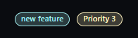
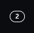
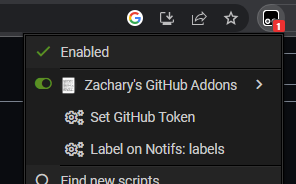

# Zachary's GitHub Addons

Just a UserScript that adds things I'd like on GitHub.

*more addons soon™️, at the moment it's just labels on notifications*

## Labels on Notifications
Just adds indicators of labels to the notification item... It reads all notifications visible on the page, and parses them into a single GraphQL query to send to GitHubs API, once received the API response, it then parses each label back onto the notification item.

There are four options of label indicators:

| Type    | Image                                 |
|---------|---------------------------------------|
| Labels  |   |
| Dots    |     |
| Counter |  |
| Off     | No labels ¯\\\_(ツ)_/¯                 |

For labels to work, it requires a GitHub Personal Access Token (with only repository permissions) to be set. Check [configuring](#configuring) on how to set...

## Configuring
Configuring is handled through the Greasemonkey feature, which is supported by Tampermonkey (which is what I use), but it's common for other userscript extensions to support it too...

Menu button for setting values is handled through the extension menu

## Installing
Working on adding to UserScript markets, but the file to add from this repo is [Zachary's GitHub Addons.user.js](https://github.com/zacwm/zacharys-github-addons/raw/main/Zachary's%20GitHub%20Addons.user.js)